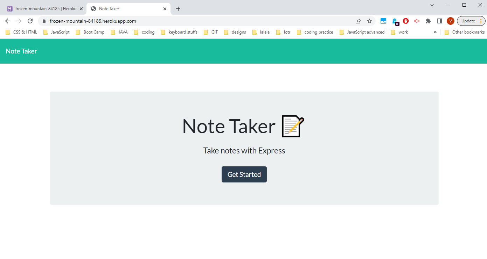
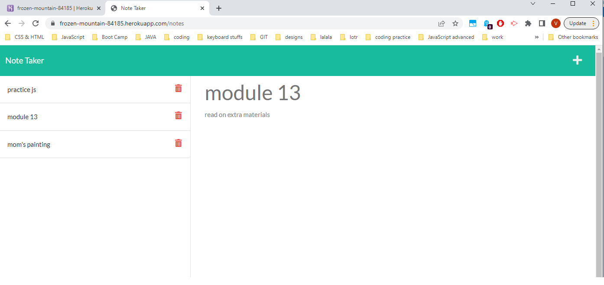

# Welcome to your Notekeeper Express
#### It's almost like a gamekeeper on Hogwarts Express but not really. 
#### Anyways, this is the place where you can store anything from your karaoke song list to that long text message draft you were meaning to send two months ago. 
#### This application has a simple and efficient functionality and is very easy to use.
  

> ### **Functionality**
The application has a user friendly interface - once you load it, the homepage will be displayed as shown below: 

  

After you press **"Get Started"** you will be redirected to the main page with two section, as you ca see here: 

  

- To _**create**_ a new note, click '+' icon button at the top right corner. 
- To _**save**_ a note you have to type in **both title and text body**. Once you done typing you will see a flat disk icon button appear in the top right corner, hit that button to save. And voila, now your note is added to the list on the left side.
- To _**delete**_ a note from the list on the left side, simply press the note so the contents appear on the right and press delete icon button.  
_P.S. since this is the first production of this app you might need to refresh the page to make sure the note was deleted_
  
> ### **How to access**
To access the deployed application on Heroku please visit [this link](https://frozen-mountain-84185.herokuapp.com/)
  

> **Thank you!** 
If you have any suggestions or would like to collaborate, please feel free to reach out [here💬](https://www.linkedin.com/in/valeriya-kim-763572204/)  
_created with💌_